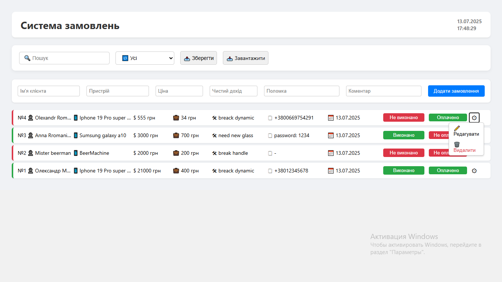
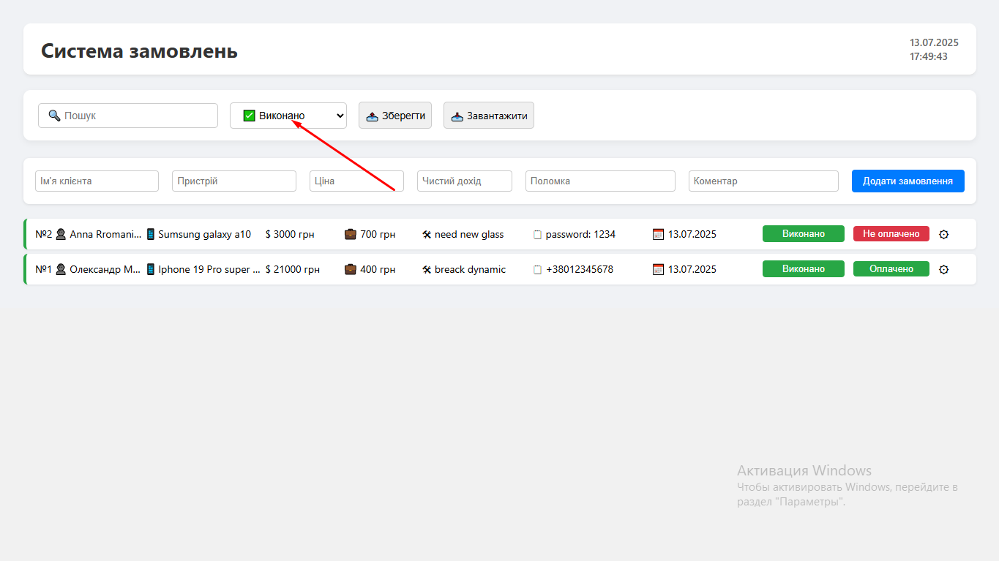

# 🧰 Order Manager App

A streamlined order-tracking system tailored for craftspersons and solo professionals to manage client orders, statuses, and job progress with clarity and control.

🔧 **Originally built for a real-life master artisan** who actively uses this tool in their daily workflow to manage incoming requests, track progress, and ensure timely delivery — the system reflects practical needs from hands-on experience.

📱 **Mobile-friendly experience included** — designed to work seamlessly across smartphones and tablets, ensuring on-the-go access with intuitive controls and adaptive layout.

## Demo

[https://reshatel.github.io/Order-Manager-App/](https://reshatel.github.io/Order-Manager-App/)

## ✨ Features

* Interactive dashboard with order status tracking
* Create, edit, and delete orders with customer details
* Filter orders by status (pending, in-progress, completed)
* Local data backup — order data is stored in structured `.json` files
* Example backup files included to demonstrate how data can be saved and restored on a user's computer
* Perfect for workshop masters, freelancers, and service professionals

## 🛠 Technologies

* [React](https://react.dev/)
* [Loki-JS](https://loki.js.org/)
* [React Scripts](https://create-react-app.dev/docs/getting-started/)
* GitHub Pages deployment

## Run Locally

### Option 1: Local dev server

<pre>
npm install  
npm start
</pre>

### Option 2: Serve from build folder

#### Using http-server

<pre>
cd path/to/build/folder  
http-server
</pre>

➡️ Available at: **http://localhost:8080**

#### Using serve

<pre>
cd path/to/build/folder  
serve -s .
</pre>

➡️ Available at: **http://localhost:5000**

## Build and Deploy

<pre>
npm run build  
npm run deploy
</pre>

## Author

Crafted for productive minds by [Reshatel](https://github.com/Reshatel) — simplifying task flow and helping artisans take charge of every order with peace of mind and professional precision.
